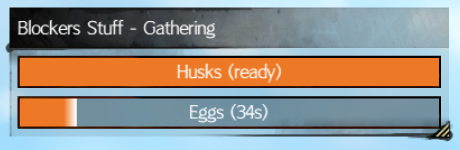

# TT Blockers Stuff

This is a little helper for the tasks that a blocker has during the triple trouble event in bloodtide coast. The idea is based on the site https://tripletrouble.today/blocker/. It's a Blish HUD Module (https://blishhud.com/) therefore that is required to run it.

## Installation

The installation of this module is simply done by opening Blish HUD -> opening the Settings -> in the Module Repo section search for "TT Blockers Stuff" and hit "Install".

## Usage

Once the module is installed it essentially starts working once you are in the bloodtide coast map and near one of the 4 spots that this module recognizes (all 3 wurm arenas and the gathering spot near Firthside Vigil Waypoint. If you are close then the Module should display a panel similar to this one in the middle of the screen:

The 2 orange bars are buttons that you can press once the wurm spits out either eggs or husks. Once the timers for the respective bar runs out / the bar fills up there will be a squad message like announcement in the middle of the screen. The panel will deal with the proper timings for all the wurms (cobalt has a slightly different timer):

There is also the helper for positioning yourself which is marked by a little icon on the left side of the title which shows you the direction in which you have to move in order to get into a good spot for blocking (if you every find a spot that is marked as valid and where you can't block please message me). Again it has a little compas for direction, changes color based on the distance and also changes the icon once you are in a correct spot (or when you are mounted .. nobody i know blocks while mounted):

#### Far away

#### Very close

#### Correct

#### Impossible (sitting on a mount)

As a last thing for usage .. you can also change the colors of the bars in the settings (The selection is still WIP for the most part but it works). And you can even resize and reposition it (Drag and drop for position on the title bar, resize on the lower right):

#### Changed colors

#### Resized

## Features

Feeld free to create an issue or open a discussion if there is anything that is not working!

- Timer bars for both eggs and husks
- Helper for positioning
- Color selection
- Mount detection
- Automatic timer setup for each wurm
- Drag and drop it whereever you want
- Resize it however you like

## TBD 

Feeld free to create an issue or open a discussion if there is anything missing!
- Sync with other blockers on the same wurm
- Audio
- Class detection (Capabilities for blocking)
- Hiding the eggs bar (Some people only wanna see the husks)
- Translations (Only english and german are currently supported .. french, spanish and korean are missing)
